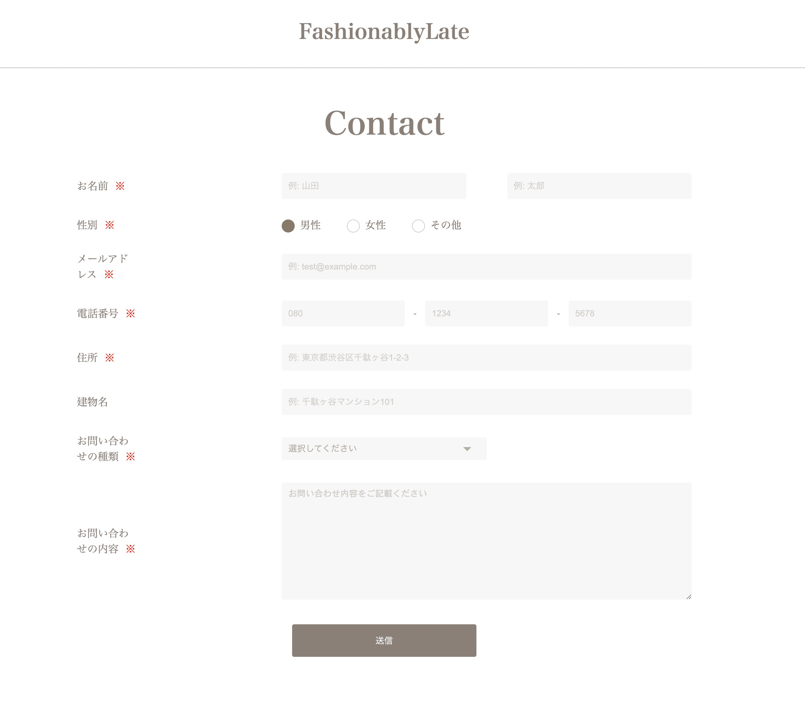
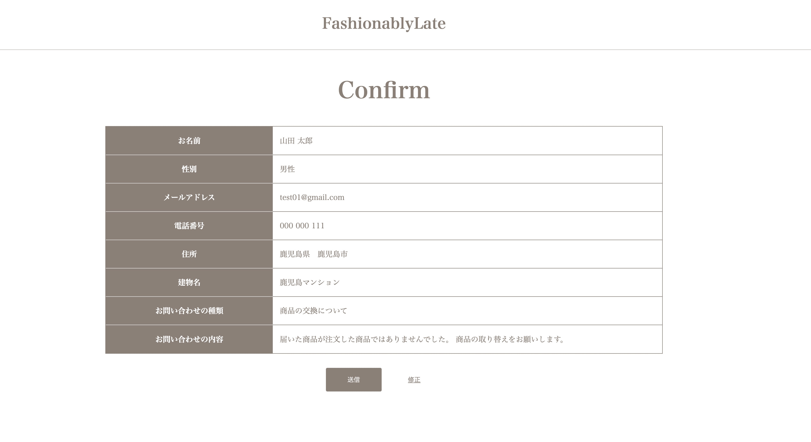
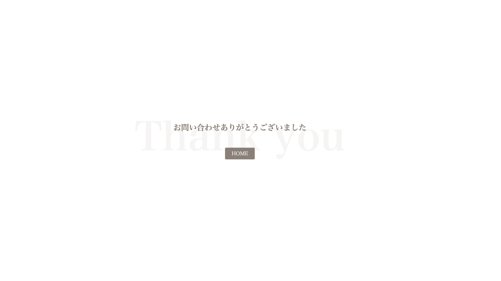
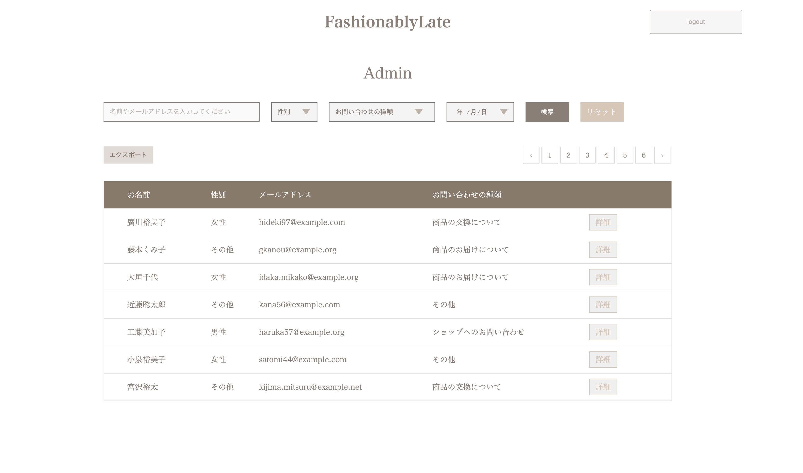
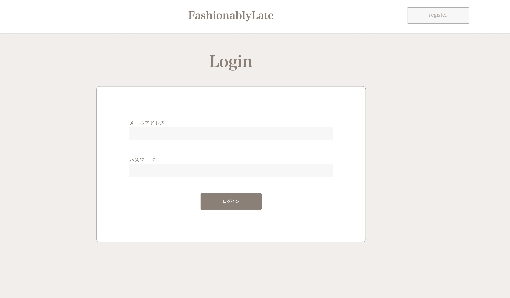
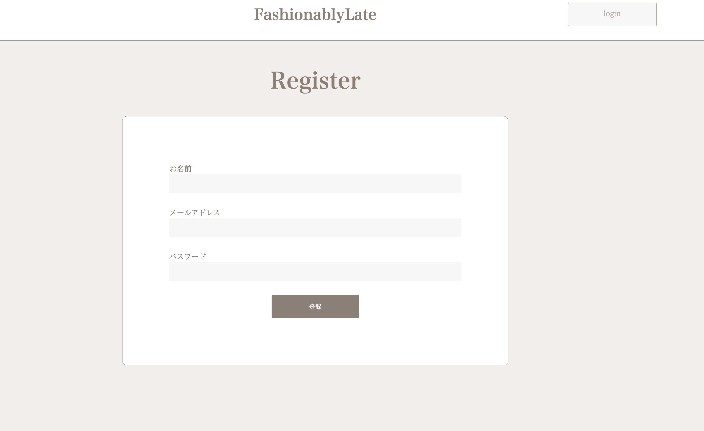

# お問い合わせ管理システム（アプリケーション名）
Laravel 10 + Fortify を使用した、管理画面付きのお問い合わせフォームです。
入力・確認・完了の 3 ステップ構成に加え、管理者による投稿内容の確認機能を備えています。

## 使用技術(実行環境)
- PHP 8.x
- Laravel 10.x
- MySQL
- Laravel Fortify
- マイグレーション、シーダー
- Laravel Sail（Docker Compose）

## 機能一覧
- フロント機能
  - お問い合わせ入力（バリデーション付）
  - 入力内容確認画面
  - 送信完了画面（サンクスページ）
- 管理機能（要認証）
  - ユーザー登録・ログイン機能（Laravel Fortify）
  - お問い合わせ一覧表示・詳細確認

## ルーティング一覧
| ページ名 | パス | 備考 |
| :--- | :--- | :--- |
| お問い合わせフォーム入力 | `/` | |
| お問い合わせフォーム確認 | `/confirm` | |
| サンクスページ | `/thanks` | |
| ログインページ | `/login` | |
| ユーザ登録ページ | `/register` | |
| 管理画面（一覧） | `/admin` | 要ログイン |

## セットアップ（初回のみ）
1. `cp .env.example .env`
2. `composer install` （またはDocker経由のインストール）
3. `./vendor/bin/sail up -d`
4. `./vendor/bin/sail artisan key:generate`
5. `./vendor/bin/sail artisan migrate:fresh --seed`

## 起動・動作確認
1. ターミナルで `./vendor/bin/sail up -d` を実行。
2. ブラウザで [http://localhost/](http://localhost/) にアクセス。
3. 管理画面を試す場合は、/register からユーザーを作成するか、シーダーで作成されたテストユーザー（設定している場合）でログインしてください。

## 画面イメージ
### フロント側
- お問い合わせフォーム入力画面
    
- お問い合わせフォーム確認画面
    
- サンクス画面
    

### 管理側
- 管理画面
    
- ログイン画面
    
- ユーザー登録画面
    